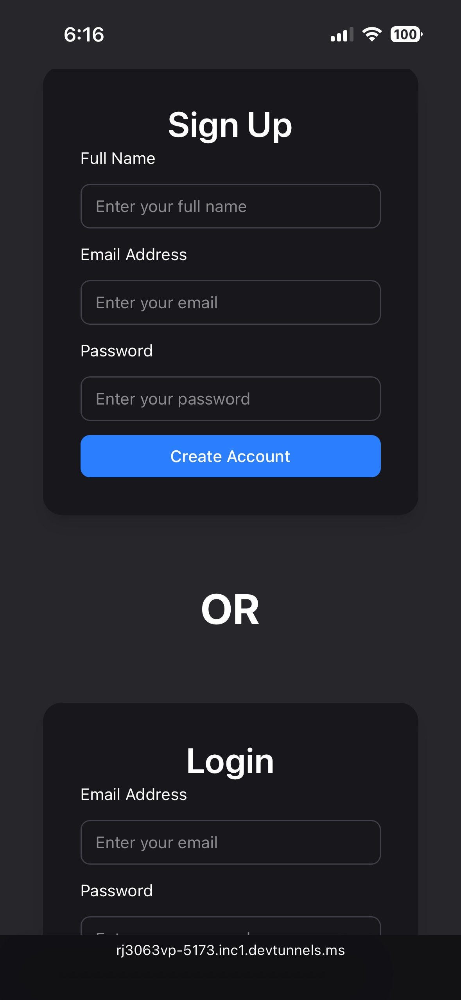
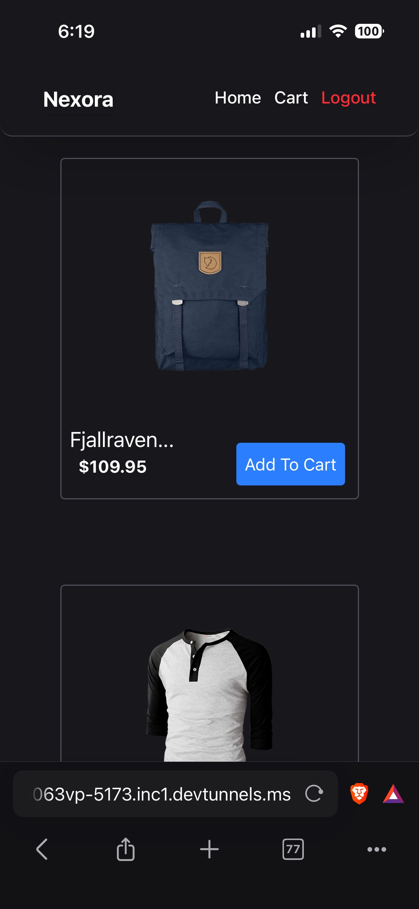
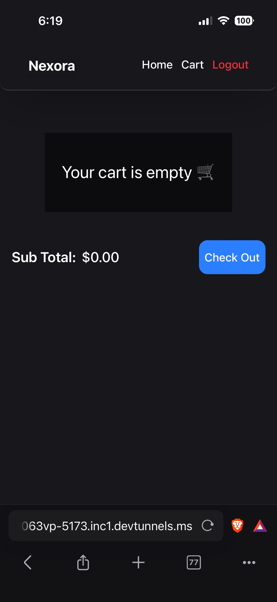
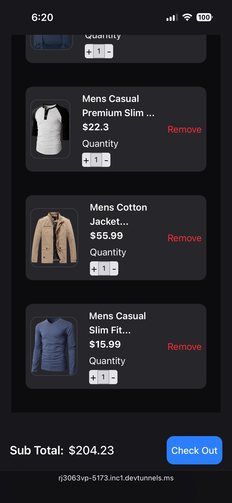
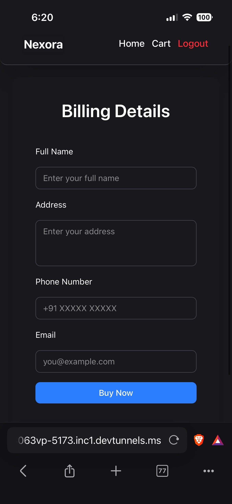
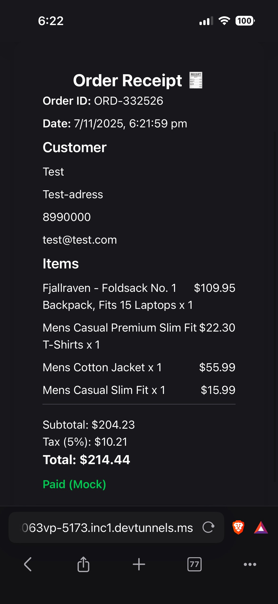

# 🛒 Full-Stack Responsive Shopping Cart App

A complete **MERN-based e-commerce project** built as part of a full-stack developer assignment.  
This app lets users **browse products**, **add them to cart**, **manage cart items**, and **checkout** with a **mock receipt** — all fully responsive for **mobile and desktop**.

---

## 🎥 Demo Video

<p align="center">
  <a href="https://youtu.be/1It0HOHtVjM" target="_blank">
    
  </a>
</p>

> 🎬 Click the image above to watch the full demo on YouTube


---

## 🖼️ Screenshots

| Page | Screenshot |
|------|-------------|
| 🔏 Signup / Login Page |  |
| 🏠 Home / Shop Page |  |
| 🧺 Empty Cart Page |  |
| 🧺 Filled Cart Page |  |
| 💳 Billing / Checkout Page |  |
| 🧾 Mock Receipt |  |


---

## 🚀 Features

### 👤 Authentication
- Secure **Signup** and **Login** using JWT + HTTP-only cookies.  
- Persistent session management.  

### 🛍️ Product Display
- Products fetched dynamically from [FakeStoreAPI](https://fakestoreapi.com/products).  
- Displayed with a modern, responsive UI built in React + TailwindCSS.  

### 🧺 Cart Management
- Add items to cart (stored in MongoDB per user).  
- Increase/decrease quantities using +/– buttons.  
- Remove items individually.  
- Subtotal auto-updates dynamically.  

### 💳 Checkout & Mock Receipt
- Billing form with name, address, email, and phone.  
- Checkout API generates a **mock order receipt** with subtotal, tax, and total.  
- Auto-clears cart post-purchase.  
- Fully responsive design on all devices.  

---

## 📱 Responsive Design Highlights

| Device | View |
|:-------|:-----|
| 📱 Mobile | Optimized product grid and stacked layout |
| 💻 Desktop | Full-width display with consistent spacing |

Built using **Tailwind’s responsive utilities** for font sizes, layout, and spacing adjustments.  

---

## 🧠 Tech Stack

**Frontend:**  
- React.js  
- Tailwind CSS  
- React Router DOM  

**Backend:**  
- Node.js  
- Express.js  
- MongoDB (Mongoose)  
- JWT + Cookie Parser  

**External API:**  
- [FakeStoreAPI](https://fakestoreapi.com/) for product data  

---

## ⚙️ API Endpoints

| Method | Endpoint | Description |
|:--|:--|:--|
| `POST` | `/api/signup` | Register new user |
| `POST` | `/api/login` | Login existing user |
| `GET` | `/api/products` | Get products from FakeStoreAPI |
| `POST` | `/api/cart/add` | Add item to user’s cart |
| `GET` | `/api/cart` | Fetch user’s cart |
| `DELETE` | `/api/cart/:id` | Remove item from cart |
| `POST` | `/api/checkout` | Generate mock receipt |

---

## 🧾 Example Receipt Response

```json
{
  "orderId": "ORD-937421",
  "customer": {
    "fullName": "John Doe",
    "address": "123 Main Street, Delhi",
    "phone": "+91 9876543210",
    "email": "john@example.com"
  },
  "items": [
    { "title": "Shirt", "price": 19.99, "quantity": 2 }
  ],
  "subtotal": "39.98",
  "tax": "2.00",
  "total": "41.98",
  "paymentStatus": "Paid (Mock)",
  "date": "2025-11-07, 10:41 PM"
}
